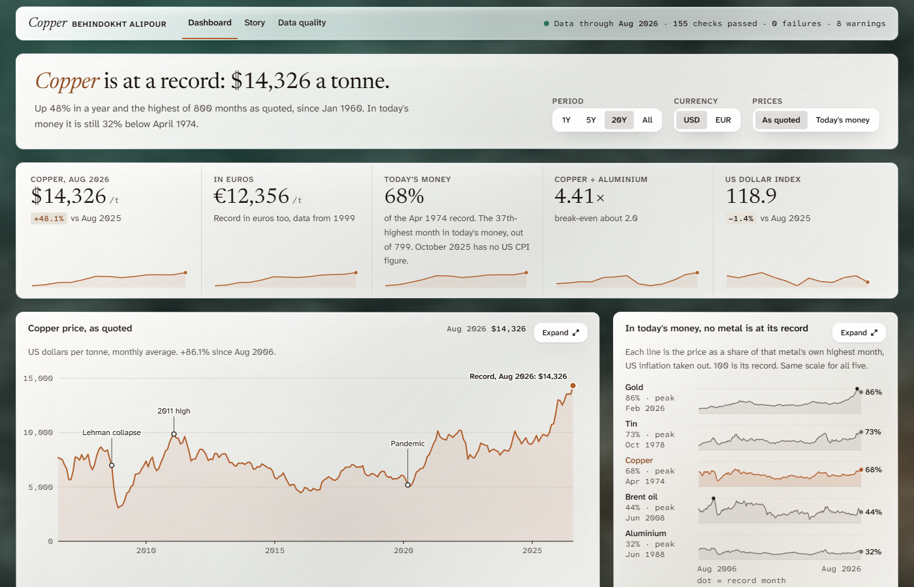
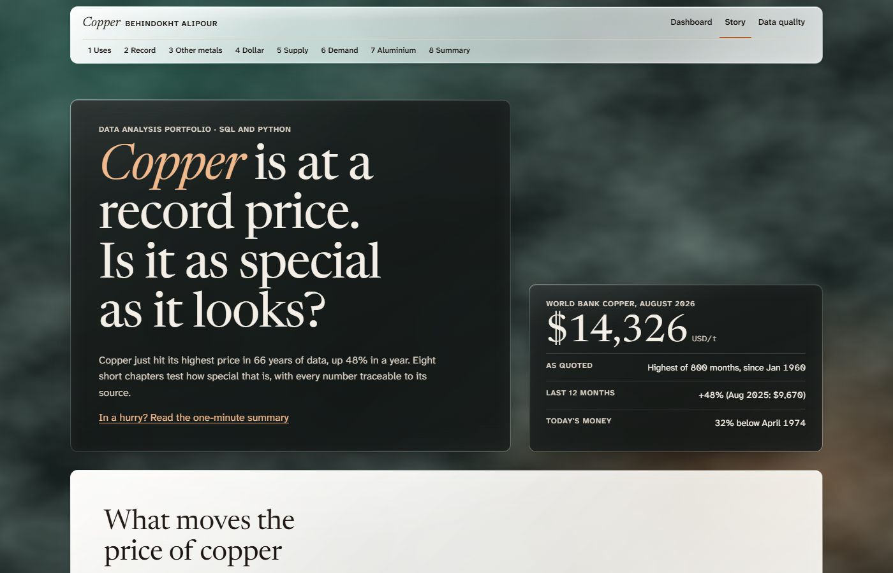

# Copper market analysis

A portfolio project by Behindokht Alipour. Copper is at a record price. Is it as special as it looks? SQL and Python, a static website, and every number traced to a source.

Live site (after GitHub Pages is switched on): https://behindokht.github.io/copper-market-analysis/  
Short write-up: [case study](https://behindokht.github.io/copper-market-analysis/case-study.html) | Every number I may quote: [FACTS.md](docs/FACTS.md)





## The question

Who needs copper, who supplies it, and what does the price do when they collide? I test three ideas: that the copper price moves against the US dollar, that a high copper to aluminium price ratio says something about later prices, and that EV and data-centre demand is a scenario and not a fact.

## Three findings

1. **Copper is at a record only as quoted.** $14,326 a tonne in August 2026, the highest of 800 months. In today's money it is still 32% below April 1974.
2. **The dollar goes with about a third of copper's monthly moves.** The broad dollar index accounts for 31% of them. In 178 of 247 months the two moved in opposite directions. The correlation is -0.56 (95% bootstrap interval -0.67 to -0.40). That is a link, not proof of a cause.
3. **Aluminium has been the cheaper conductor metal for 213 months.** Copper costs 4.41 times aluminium and the break-even is about 2.01. As a guide to later price changes the ratio is weak, and I say so.

Demand from EVs and data centres is shown as a share of today's mine output, never as a gap or a shortage, because there is no supply projection.

## How it works

```
raw downloads (World Bank, FRED, USGS, ICSG, IEA, LME)
   |  copper_database/build_db.py loads each file as it is
raw_ tables
   |  copper_database/sql/01_staging.sql: types, NULLs, duplicates
stg_ tables
   |  copper_database/sql/02_marts.sql: the analysis tables
mart_ tables  --->  03_checks.sql  --->  data_checks (PASS, WARN, FAIL)
   |  notebooks/01 to 07: statistics (pandas, statsmodels), figures
results/res_*.csv  (also written back into the database)
   |  tools/export_site_data.py: copies the results, calculates nothing
docs/data/*.js  --->  docs/ static site (plain JavaScript and SVG)
```

Cleaning and joins are done in SQL, statistics and charts in Python. 34 registered sources, 163 automatic checks (155 pass, 8 warnings, 0 failures). Statistics use monthly changes, a moving-block bootstrap for intervals and Newey-West standard errors in the regressions.

## Rebuild

The raw downloads are not in this repository. Download them (the links are in `copper_database/collected/sources.csv`) into the repository root, then:

```
python -m venv .venv
.venv\Scripts\activate               # Windows. On macOS or Linux: source .venv/bin/activate
pip install -r requirements.txt       # pandas, statsmodels, jupyter tools for the notebooks
pip install openpyxl                  # build_db.py reads the Excel downloads
python copper_database/build_db.py --raw .
python -m jupyter nbconvert --to notebook --execute --inplace notebooks/06_story_brief_figures.ipynb
python -m jupyter nbconvert --to notebook --execute --inplace notebooks/05_chapter_facts.ipynb
python -m jupyter nbconvert --to notebook --execute --inplace notebooks/07_dashboard.ipynb
python -m jupyter nbconvert --to notebook --execute --inplace notebooks/04_dashboard_exports.ipynb
python copper_database/build_db.py --raw .      # reload the results into the database
python tools/export_site_data.py
python tools/build_provenance.py
python tools/check_site.py
python tools/audit_public.py
python tools/serve_docs.py 8765               # then open http://127.0.0.1:8765/
```

The browser tests also need `pip install playwright pillow fonttools brotli` and Google Chrome.

Notebooks 01 to 03 run the same way. The month-end robustness result needs LME daily data that I download myself and cannot publish: it is provided as a file (`results/res_dollar_month_end_check.csv`), so the project is not fully reproducible without that data.

## Data sources and licences

- World Bank Commodity Price Data (Pink Sheet), adapted: CC BY 4.0 (S02)
- FRED: dollar index, euro rate, 10-year yield, US CPI, aluminium: public domain (citation requested), aluminium series under FRED and IMF terms (S16)
- USGS Mineral Commodity Summaries: US government work (S06)
- ICSG World Copper Factbook: cited, not republished (S31)
- NBS Circular 31 (wire tables): US government work (S32)
- IEA Global EV Outlook and Energy and AI data: IEA terms, which I have not confirmed yet (S05)
- Natural Earth and world-atlas for the map: public domain and ISC (S29)
- LME copper daily: commercial, never published; only derived statistics are (S01)
- Background photo: licence not confirmed, kept out of the repository (S35)

Published series use the World Bank copper price, never the LME series. The full register, with a reliability rating for each source, is `copper_database/collected/sources.csv` and the appendix of the site.

## Known issues (open)

- **K01** The sources do not state whether 30-40 tonnes of copper per MW refer to total installed capacity or IT capacity
- **K02** S13 reports 1.1 Mt of data-centre copper demand for 2025
- **K03** The IEA EV data has no hybrid (HEV) split
- **K04** The IEA file has no 2030 EV projection (2025 actuals and 2035 scenarios only)
- **K05** IEA numbers are rounded to two significant figures and EV shares to whole percent
- **K06** Vans, buses, trucks and 2 and 3-wheelers have no copper intensity in the project data and are excluded; fuel-cell cars are excluded too (about 7,000 s...
- **K07** The ICSG World Copper Factbook figures (end-use shares, China 58% of refined use, recycled share, wire share, 23 Mt mined and 27.4 Mt used in 2024) we...
- **K08** Background photo licence unconfirmed

Each one is also a warning in `data_checks`. The site shows them in the data quality appendix.

## Tests and publishing

`tools/check_site.py` (text, fonts, contrast, links), `tools/audit_public.py` (nothing private is published), `tools/dashboard_test.py`, `tools/parity_test.py` and `tools/round4_test.py` (browser tests in Chromium and WebKit), `tools/check_pages.py` (GitHub Pages readiness) and `tools/run_lighthouse.py`. `tools/build_facts.py` and `tools/build_readme.py` write the facts sheet and this file from the data.

## Not investment advice

Historical results are not forecasts and not investment advice. A link between two series in a sample is not proof that one moves the other. The demand figures are scenarios.

No licence has been chosen for the code yet, so others may not reuse it until one is added. Fonts are SIL Open Font License, see `CREDITS.md`.
